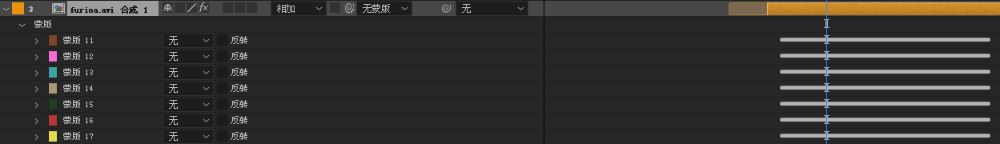

<!-- TOC -->

- [图层](#%E5%9B%BE%E5%B1%82)
    - [自动追踪](#%E8%87%AA%E5%8A%A8%E8%BF%BD%E8%B8%AA)
- [效果](#%E6%95%88%E6%9E%9C)
    - [生成](#%E7%94%9F%E6%88%90)
        - [音频波形，音频频谱](#%E9%9F%B3%E9%A2%91%E6%B3%A2%E5%BD%A2%E9%9F%B3%E9%A2%91%E9%A2%91%E8%B0%B1)
        - [常用的渐变色背景](#%E5%B8%B8%E7%94%A8%E7%9A%84%E6%B8%90%E5%8F%98%E8%89%B2%E8%83%8C%E6%99%AF)
        - [光束](#%E5%85%89%E6%9D%9F)
        - [光束 saber video-copilot](#%E5%85%89%E6%9D%9F-saber-video-copilot)
    - [透视 perspective](#%E9%80%8F%E8%A7%86-perspective)
        - [投影 drop shadow](#%E6%8A%95%E5%BD%B1-drop-shadow)
    - [风格化 stylize](#%E9%A3%8E%E6%A0%BC%E5%8C%96-stylize)
        - [发光 glow](#%E5%8F%91%E5%85%89-glow)

<!-- /TOC -->

# 图层

## 自动追踪

会返回一堆mask的路径。

# 效果

## 生成

### 音频波形，音频频谱
应用在solid上。

在solid里用钢笔创建蒙版（可以只是曲线），然后在特效里选择路径应用到该模板。

### 常用的渐变色背景

梯度渐变/四色渐变，比较简单。

### 光束

没有那么亮，所以用以下这个插件比较好。

### 光束 saber video-copilot

下载：https://www.videocopilot.net/blog/?s=saberl

配合 [图层-边缘追踪](#%E8%87%AA%E5%8A%A8%E8%BF%BD%E8%B8%AA) 可以实现这样的效果：

改变alpha mode 或者 mask反转，可以得到不同的效果。

start offset 等参数可以用作制作变化动画。

## 透视 perspective

### 投影 drop shadow

调高柔和度形成泛光效果

## 风格化 stylize

### 发光 glow

结合投影效果不错。

