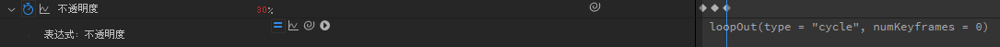

<!-- TOC -->

- [图层 layer](#%E5%9B%BE%E5%B1%82-layer)
    - [跟踪遮罩](#%E8%B7%9F%E8%B8%AA%E9%81%AE%E7%BD%A9)
    - [自动追踪](#%E8%87%AA%E5%8A%A8%E8%BF%BD%E8%B8%AA)
    - [各种模式](#%E5%90%84%E7%A7%8D%E6%A8%A1%E5%BC%8F)
        - [屏幕模式 Screen](#%E5%B1%8F%E5%B9%95%E6%A8%A1%E5%BC%8F-screen)
        - [模板亮度](#%E6%A8%A1%E6%9D%BF%E4%BA%AE%E5%BA%A6)
- [效果](#%E6%95%88%E6%9E%9C)
    - [CC](#cc)
        - [radial blur](#radial-blur)
    - [生成](#%E7%94%9F%E6%88%90)
        - [网格 grid グリッド](#%E7%BD%91%E6%A0%BC-grid-%E3%82%B0%E3%83%AA%E3%83%83%E3%83%89)
        - [音频波形，音频频谱](#%E9%9F%B3%E9%A2%91%E6%B3%A2%E5%BD%A2%E9%9F%B3%E9%A2%91%E9%A2%91%E8%B0%B1)
        - [常用的渐变色背景 Gradient](#%E5%B8%B8%E7%94%A8%E7%9A%84%E6%B8%90%E5%8F%98%E8%89%B2%E8%83%8C%E6%99%AF-gradient)
        - [光束](#%E5%85%89%E6%9D%9F)
        - [光束 saber video-copilot](#%E5%85%89%E6%9D%9F-saber-video-copilot)
    - [透视 perspective](#%E9%80%8F%E8%A7%86-perspective)
        - [投影 drop shadow](#%E6%8A%95%E5%BD%B1-drop-shadow)
    - [通道](#%E9%80%9A%E9%81%93)
        - [转换通道](#%E8%BD%AC%E6%8D%A2%E9%80%9A%E9%81%93)
        - [设置通道](#%E8%AE%BE%E7%BD%AE%E9%80%9A%E9%81%93)
    - [风格化 stylize](#%E9%A3%8E%E6%A0%BC%E5%8C%96-stylize)
        - [动态拼贴](#%E5%8A%A8%E6%80%81%E6%8B%BC%E8%B4%B4)
        - [发光 glow](#%E5%8F%91%E5%85%89-glow)
    - [扭曲](#%E6%89%AD%E6%9B%B2)
        - [波形变形](#%E6%B3%A2%E5%BD%A2%E5%8F%98%E5%BD%A2)
        - [置换图 Displacement Map ディスプレイスメントマップ](#%E7%BD%AE%E6%8D%A2%E5%9B%BE-displacement-map-%E3%83%87%E3%82%A3%E3%82%B9%E3%83%97%E3%83%AC%E3%82%A4%E3%82%B9%E3%83%A1%E3%83%B3%E3%83%88%E3%83%9E%E3%83%83%E3%83%97)
    - [颜色矫正](#%E9%A2%9C%E8%89%B2%E7%9F%AB%E6%AD%A3)
        - [三色调 tritone](#%E4%B8%89%E8%89%B2%E8%B0%83-tritone)
        - [色光 colorama](#%E8%89%B2%E5%85%89-colorama)
    - [模糊和锐化](#%E6%A8%A1%E7%B3%8A%E5%92%8C%E9%94%90%E5%8C%96)
        - [高斯模糊](#%E9%AB%98%E6%96%AF%E6%A8%A1%E7%B3%8A)
    - [杂色和颗粒](#%E6%9D%82%E8%89%B2%E5%92%8C%E9%A2%97%E7%B2%92)
        - [杂色 noise](#%E6%9D%82%E8%89%B2-noise)
        - [分形杂色 fractal noise フラクタルノイズ](#%E5%88%86%E5%BD%A2%E6%9D%82%E8%89%B2-fractal-noise-%E3%83%95%E3%83%A9%E3%82%AF%E3%82%BF%E3%83%AB%E3%83%8E%E3%82%A4%E3%82%BA)
            - [显像管扫描感](#%E6%98%BE%E5%83%8F%E7%AE%A1%E6%89%AB%E6%8F%8F%E6%84%9F)
            - [像素感方块过场](#%E5%83%8F%E7%B4%A0%E6%84%9F%E6%96%B9%E5%9D%97%E8%BF%87%E5%9C%BA)
            - [放射状背景](#%E6%94%BE%E5%B0%84%E7%8A%B6%E8%83%8C%E6%99%AF)
    - [模糊](#%E6%A8%A1%E7%B3%8A)
        - [定向模糊](#%E5%AE%9A%E5%90%91%E6%A8%A1%E7%B3%8A)
    - [过渡](#%E8%BF%87%E6%B8%A1)
        - [渐变擦除 scale wipe](#%E6%B8%90%E5%8F%98%E6%93%A6%E9%99%A4-scale-wipe)

<!-- /TOC -->

# 图层 layer

## 跟踪遮罩

使用一个图层的透明度或亮度信息来控制另一个图层的可见性的方法。如果看不到，可以右键点击时间轴的标题栏，并选择“Columns”>“Modes”来显示

## 自动追踪

会返回一堆mask的路径。


## 各种模式

### 屏幕模式 Screen

用于创建叠加效果，通常用于合成光效、烟雾、火焰等。结果颜色 = 1 - (1 - 上层颜色) * (1 - 下层颜色)，这一模式的效果类似于将两张图像的反向值相乘，结果是颜色变亮并且较暗的区域变得透明。如果上层图像是黑色（颜色值为0），则不会对下层图像产生任何影响。如果上层图像是白色（颜色值为1），则下层图像将变得完全白色。

### 模板亮度

配合杂色得到这样的效果。


# 效果

## CC

### radial blur

形成四散的辐射状模糊，可以模拟丁达尔效应。https://www.youtube.com/watch?v=JOQ5UtZuaEg

## 生成

### 网格 grid グリッド


### 音频波形，音频频谱

应用在solid上。在特效里选择对应的音频。


在solid里用钢笔创建蒙版（可以只是曲线），然后在特效里选择路径应用到该模板。


### 常用的渐变色背景 Gradient

梯度渐变/四色渐变，比较简单。

### 光束

没有那么亮，所以用以下这个插件比较好。

### 光束 saber video-copilot

下载：https://www.videocopilot.net/blog/?s=saberl

配合 [图层-边缘追踪](#%E8%87%AA%E5%8A%A8%E8%BF%BD%E8%B8%AA) 可以实现这样的效果：


改变alpha mode 或者 mask反转，可以得到不同的效果。


start offset 等参数可以用作制作变化动画。

## 透视 perspective

### 投影 drop shadow


调高柔和度形成泛光效果


## 通道

### 转换通道

### 设置通道

把RGB提取出来，形成常用的RGB效果。


## 风格化 stylize

### 动态拼贴

可以快速得到如下效果：


也可以用于修复一些特效边缘的问题。也可以只修改中心位置控制整体位置。（好处就是不会有黑边）

```
posterizeTime(10);
tempx = effect("动态拼贴")("拼贴中心")[0];
tempy = effect("动态拼贴")("拼贴中心")[1];
[tempx+noise(time*5)*20, tempy+noise(time*6)*20]
```
posterizeTime 帧数，noise类似random。

### 发光 glow


结合投影效果不错。


## 扭曲

### 波形变形

### 置换图 Displacement Map ディスプレイスメントマップ

用于位移像素，和分形的源配合使用可以实现填充。其中水平置换和垂直置换是填入像素内容的相对位移。出现空缺用动态粘贴来修复。


## 颜色矫正

### 三色调 tritone

可以先用色光里的灰度，再用三色调转换，这样不会太杂。

### 色光 colorama


## 模糊和锐化

### 高斯模糊

## 杂色和颗粒

### 杂色 noise

一般像素点的杂色

### 分形杂色 fractal noise フラクタルノイズ

#### 显像管扫描感




透明度，创建3个帧分别为30%，15%，30%，运用循环脚本。


偏移设置：
```
x = effect("分形杂色")("偏移（湍流）")[0];
y = effect("分形杂色")("偏移（湍流）")[1];
[x, y+time*30]
```

#### 像素感方块过场

两个纯色图层：
- 梯度渐变：混合模式选择纯色混合。渐变方向会控制分形的变化方向。
  
- 分形杂色：用亮度控制分形的变化。
  

为解决如何使得黑色背景改为透明，来作为更好的过渡使用。目前退而求其次的解决方案是选择其他叠加模式。

#### 放射状背景

教程：[最も簡単に放射状の流背を作成する手順【AfterEffects】](https://www.youtube.com/watch?v=-Nk2VKjBEko)

创建分形，偏移湍流参数造成流动的效果：
```
x = effect("分形杂色")("偏移（湍流）")[0];
y = effect("分形杂色")("偏移（湍流）")[1]+time*2000;
[x, y]
```
演化参数，造成局部随机感：
```
time*300
```

调整图层使用：极坐标（矩形到极线），光学补偿（FOV 115，反转镜头扭曲）


为了使得极坐标中间衔接处自然，用一下这种方法修复。


修复后：


## 模糊

### 定向模糊

## 过渡

### 渐变擦除 scale wipe